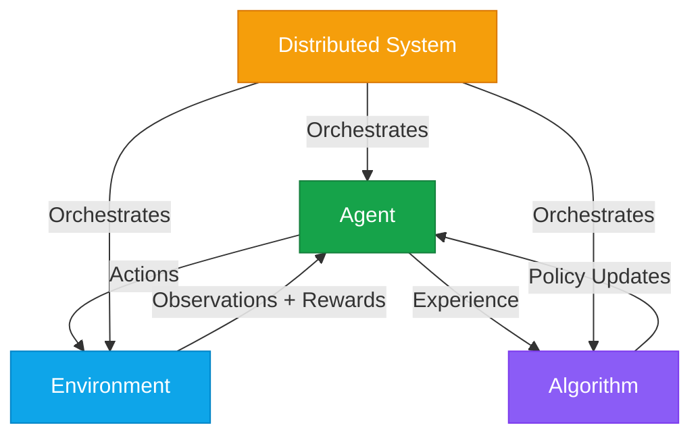

Artemis RL Gym is built around three core components that work together to provide a comprehensive reinforcement learning framework for Large Language Models. This page provides an overview of these components and how they interact.

## Architecture Overview

The core of Artemis consists of three primary components:

<CardGroup cols={3}>
<Card title="Agents" icon="robot" href="/artemis/core/agents">
  Intelligence that learns and makes decisions
</Card>

<Card title="Environments" icon="globe" href="/artemis/core/environments">
  Interactive scenarios for training and evaluation
</Card>

<Card title="Algorithms" icon="calculator" href="/artemis/algorithms/overview">
  Learning mechanisms that drive improvement
</Card>
</CardGroup>

## Component Interaction Flow



## Core Component Types

### Agents

Agents are the decision-making entities in Artemis. They receive observations from environments and produce actions based on their learned policies.

<Tabs>
<Tab title="BaseAgent">
  The foundational interface that all agents implement:

  ```python
  from artemis.core.agent import BaseAgent

  class BaseAgent(ABC):
      def get_action(self, observation: Observation) -> Action
      def update_policy(self, experience: Experience) -> None
      def save_checkpoint(self, path: str) -> None
      def load_checkpoint(self, path: str) -> None
  ```
</Tab>

<Tab title="LLMAgent">
  Specialized for Large Language Model training:

  ```python
  from artemis.agents.llm_agent import LLMAgent

  agent = LLMAgent(
      model_name="meta-llama/Llama-3.1-8B-Instruct",
      use_lora=True,
      use_grpo=True
  )
  ```
</Tab>

<Tab title="Custom Agents">
  Build your own agents by extending BaseAgent:

  ```python
  class CustomBusinessAgent(BaseAgent):
      def get_action(self, observation):
          # Custom decision logic
          return self.policy(observation)
  ```
</Tab>
</Tabs>

### Environments

Environments provide the interactive scenarios where agents learn and are evaluated.

<AccordionGroup>
<Accordion title="Mathematical Reasoning">
  Environments focused on mathematical problem solving:
  - Arithmetic and algebra problems
  - Calculus and advanced mathematics  
  - Step-by-step reasoning evaluation
  - GSM8K dataset integration
</Accordion>

<Accordion title="Code Generation">
  Programming and software development tasks:
  - Multi-language code generation
  - Bug fixing and debugging
  - Algorithm implementation
  - HumanEval dataset support
</Accordion>

<Accordion title="Conversation">
  Dialogue and natural language interaction:
  - Customer support scenarios
  - Educational tutoring
  - Creative writing assistance
  - Multi-turn conversation handling
</Accordion>

<Accordion title="Reasoning">
  General reasoning and problem-solving:
  - Logical reasoning tasks
  - Common sense reasoning
  - Multi-step problem solving
  - MMLU dataset integration
</Accordion>
</AccordionGroup>

### Algorithms

The learning mechanisms that enable agents to improve their performance over time.

<Tabs>
<Tab title="GRPO">
  **Group Relative Policy Optimization** - Advanced policy gradient method:
  
  ```python
  from artemis.rl_algorithms.grpo import GRPO, GRPOConfig

  config = GRPOConfig(
      num_reference_policies=3,
      reference_weight=0.1,
      kl_penalty_coefficient=0.02
  )
  ```

  Key features:
  - Multiple reference policy optimization
  - Improved sample efficiency
  - Stable training dynamics
</Tab>

<Tab title="DPO">
  **Direct Preference Optimization** - Preference-based learning:

  ```python
  from artemis.rl_algorithms.dpo import DPO, DPOConfig

  config = DPOConfig(
      beta=0.1,
      loss_type="sigmoid",
      label_smoothing=0.0
  )
  ```

  Key features:
  - No reward model required
  - Direct preference learning
  - Human feedback integration
</Tab>

<Tab title="PPO">
  **Proximal Policy Optimization** - Reliable baseline:

  ```python
  from artemis.rl_algorithms.ppo import PPO, PPOConfig

  config = PPOConfig(
      clip_epsilon=0.2,
      value_coefficient=0.5,
      entropy_coefficient=0.01
  )
  ```

  Key features:
  - Stable and reliable
  - Well-tested algorithm
  - Good baseline performance
</Tab>
</Tabs>

## Configuration and Lifecycle

### Component Configuration

Each component follows a consistent configuration pattern:

```python
from artemis.core.agent import AgentConfig
from artemis.core.env import EnvironmentConfig
from artemis.rl_algorithms.base_rl import AlgorithmConfig

# Agent configuration
agent_config = AgentConfig(
    agent_type=AgentType.LLM,
    model_name="microsoft/DialoGPT-medium",
    device="cuda",
    batch_size=4
)

# Environment configuration
env_config = EnvironmentConfig(
    env_type="conversation",
    max_steps=10,
    reward_shaping=True
)

# Algorithm configuration
algo_config = GRPOConfig(
    learning_rate=1e-4,
    num_reference_policies=3
)
```

### Component Lifecycle

<Steps>
<Step title="Initialization">
  Components are created with their respective configurations:

  ```python
  agent = LLMAgent(agent_config)
  environment = ConversationEnvironment(env_config)
  algorithm = GRPO(algo_config)
  ```
</Step>

<Step title="Training Loop">
  Components interact in a standard RL training loop:

  ```python
  for episode in range(num_episodes):
      observation = environment.reset()
      done = False
      
      while not done:
          action = agent.get_action(observation)
          observation, reward, done = environment.step(action)
          experience = (obs, action, reward, next_obs)
          algorithm.update(experience)
  ```
</Step>

<Step title="Evaluation">
  Periodic evaluation to measure progress:

  ```python
  eval_metrics = evaluate_agent(agent, eval_environment)
  if eval_metrics['reward'] > best_reward:
      agent.save_checkpoint("best_model.pt")
  ```
</Step>

<Step title="Cleanup">
  Proper resource cleanup:

  ```python
  agent.close()
  environment.close()
  algorithm.cleanup()
  ```
</Step>
</Steps>

## Best Practices

### Component Selection

<Tip>
Choose components based on your specific use case:

- **Small models + Simple tasks**: Use PPO with basic environments
- **Large models + Complex tasks**: Use GRPO with specialized environments  
- **Human feedback scenarios**: Use DPO with preference data
- **Production deployments**: Enable distributed mode for all components
</Tip>

### Performance Optimization

<Tabs>
<Tab title="Memory Management">
  ```python
  # Use LoRA for memory efficiency
  agent_config.use_lora = True
  agent_config.lora_r = 16

  # Enable gradient checkpointing
  agent_config.use_gradient_checkpointing = True

  # Optimize batch sizes
  agent_config.batch_size = 2  # Start small, increase as needed
  ```
</Tab>

<Tab title="Computational Efficiency">
  ```python
  # Use mixed precision training
  agent_config.use_fp16 = True

  # Enable optimized attention
  agent_config.use_flash_attention = True

  # Distribute across GPUs
  agent_config.use_distributed = True
  ```
</Tab>

<Tab title="Training Stability">
  ```python
  # Use stable learning rates
  algo_config.learning_rate = 1e-4

  # Enable gradient clipping
  algo_config.max_grad_norm = 1.0

  # Use appropriate KL penalties
  algo_config.kl_penalty_coefficient = 0.02
  ```
</Tab>
</Tabs>

## Error Handling and Debugging

### Common Issues

<AccordionGroup>
<Accordion title="Agent not learning">
  **Symptoms**: Reward not improving, policy not changing
  
  **Solutions**:
  - Check learning rate (try 1e-4 to 1e-5)
  - Verify environment rewards are non-zero
  - Ensure proper observation preprocessing
  - Check for gradient flow issues
</Accordion>

<Accordion title="Training instability">
  **Symptoms**: Loss spikes, NaN values, erratic behavior
  
  **Solutions**:
  - Reduce learning rate
  - Enable gradient clipping
  - Use smaller batch sizes
  - Check for data corruption
</Accordion>

<Accordion title="Memory issues">
  **Symptoms**: CUDA out of memory, system freezing
  
  **Solutions**:
  - Enable LoRA training
  - Reduce sequence length
  - Use gradient checkpointing
  - Implement batch size reduction
</Accordion>
</AccordionGroup>

### Debugging Tools

```python
# Enable detailed logging
import logging
logging.basicConfig(level=logging.DEBUG)

# Use debugging modes
agent_config.debug_mode = True
env_config.verbose = True
algo_config.log_gradients = True

# Monitor training metrics
from artemis.utils.monitoring import TrainingMonitor

monitor = TrainingMonitor()
monitor.watch(agent, environment, algorithm)
```

## Next Steps

Now that you understand the core components, dive deeper into each area:

<CardGroup cols={3}>
<Card title="Detailed Agent Guide" icon="robot" href="/artemis/core/agents">
  Learn about agent types and customization
</Card>

<Card title="Environment Guide" icon="globe" href="/artemis/core/environments">
  Explore available environments and create custom ones
</Card>

<Card title="Algorithm Deep Dive" icon="calculator" href="/artemis/algorithms/overview">
  Master the RL algorithms powering Artemis
</Card>
</CardGroup>