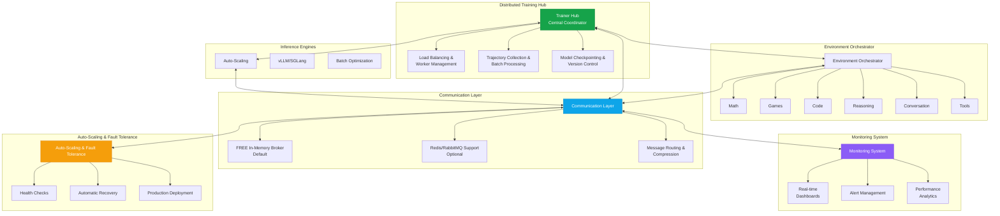
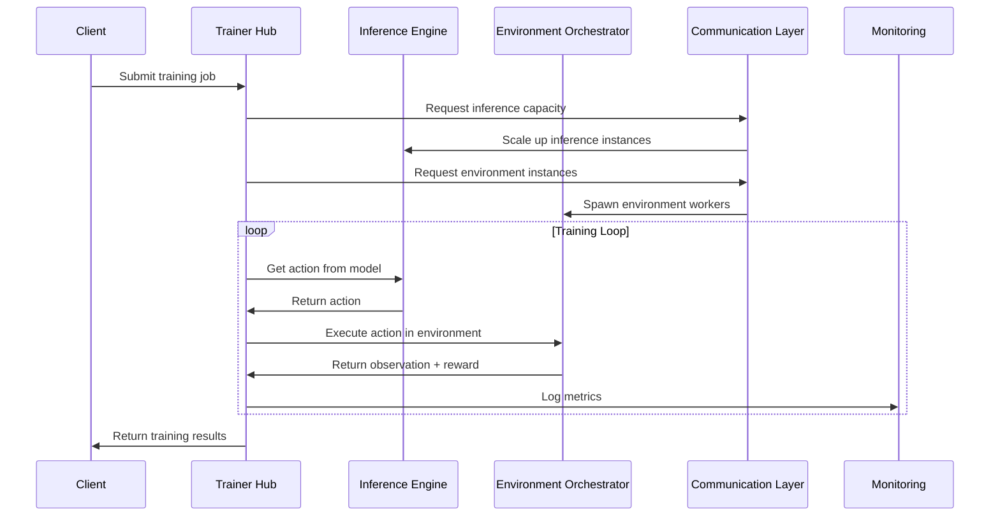
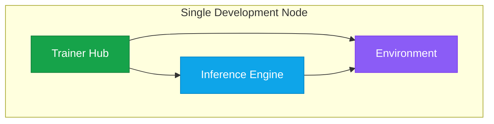
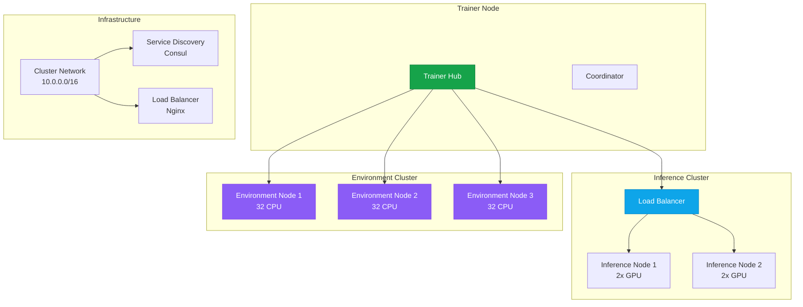
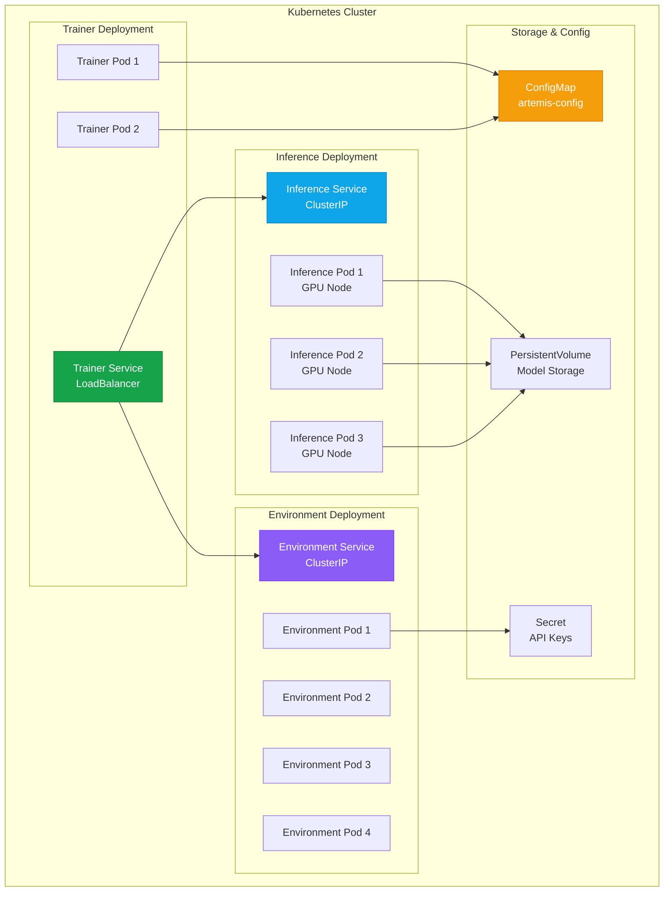

Artemis RL Gym features a sophisticated distributed system designed to scale reinforcement learning training across multiple nodes while maintaining high availability and fault tolerance. The system is built around five core distributed components that work together seamlessly.

## Architecture Overview



The distributed system consists of:

<CardGroup cols={2}>
<Card title="Distributed Trainer Hub" icon="hub" href="/artemis/distributed/trainer-hub">
  Central coordinator for distributed RL training
</Card>

<Card title="Scalable Inference Engine" icon="server" href="/artemis/distributed/inference-engine">
  Auto-scaling LLM inference with vLLM/SGLang backends
</Card>

<Card title="Environment Orchestrator" icon="globe" href="/artemis/distributed/environment-orchestrator">
  Manages multiple specialized environments with load balancing
</Card>

<Card title="Communication Layer" icon="network-wired" href="/artemis/distributed/communication">
  FREE in-memory broker with Redis/RabbitMQ support
</Card>

<Card title="Monitoring System" icon="chart-line" href="/artemis/distributed/monitoring">
  Real-time dashboards, alerting, and analytics
</Card>

<Card title="Deployment Manager" icon="cog" href="/artemis/distributed/deployment">
  Production orchestration with auto-scaling and fault tolerance
</Card>
</CardGroup>

## Key Features

### Zero-Cost Communication

<Tip>
Artemis includes a FREE in-memory message broker that eliminates the need for Redis or RabbitMQ infrastructure while maintaining full distributed functionality.
</Tip>

```python
# Default: FREE in-memory broker
communication = CommunicationLayer({"broker_type": "memory"})

# Optional: Redis/RabbitMQ for enterprise deployments
communication = CommunicationLayer({
    "broker_type": "redis",
    "redis_url": "redis://localhost:6379"
})
```

### Auto-Scaling Infrastructure

The system automatically scales based on load and performance metrics:

<Tabs>
<Tab title="Inference Scaling">
  ```python
  inference_config = {
      "min_instances": 2,
      "max_instances": 8,
      "target_cpu_utilization": 70,
      "target_memory_utilization": 80,
      "scale_up_cooldown": 300,  # seconds
      "scale_down_cooldown": 600
  }
  ```
</Tab>

<Tab title="Environment Scaling">
  ```python
  environment_config = {
      "min_instances": 4,
      "max_instances": 16,
      "target_request_rate": 100,  # requests/second
      "queue_length_threshold": 50,
      "auto_spawn_environments": True
  }
  ```
</Tab>

<Tab title="Training Scaling">
  ```python
  training_config = {
      "min_workers": 1,
      "max_workers": 32,
      "worker_memory_limit": "8GB",
      "worker_cpu_limit": 4,
      "elastic_scaling": True
  }
  ```
</Tab>
</Tabs>

### Fault Tolerance

<AccordionGroup>
<Accordion title="Health Checks">
  Continuous monitoring of all system components:

  ```python
  health_check_config = {
      "interval": 30,  # seconds
      "timeout": 10,
      "retries": 3,
      "endpoints": [
          "/health/inference",
          "/health/environment", 
          "/health/training"
      ]
  }
  ```
</Accordion>

<Accordion title="Automatic Recovery">
  Failed components are automatically restarted:

  ```python
  recovery_config = {
      "max_restarts": 5,
      "restart_delay": 60,  # seconds
      "exponential_backoff": True,
      "circuit_breaker_threshold": 10
  }
  ```
</Accordion>

<Accordion title="Graceful Degradation">
  System continues operating with reduced capacity during failures:

  ```python
  degradation_config = {
      "min_healthy_percentage": 50,
      "priority_workloads": ["critical_training"],
      "fallback_strategies": ["reduce_batch_size", "increase_intervals"]
  }
  ```
</Accordion>
</AccordionGroup>

## Quick Setup

### Minimal Configuration

For development and testing:

```python
from artemis.distributed import DeploymentManager

# Minimal setup with auto-scaling disabled
config = {
    "communication": {"broker_type": "memory"},
    "monitoring": {"collector_type": "memory"},
    "scaling": {
        "inference": {"min_instances": 1, "max_instances": 2},
        "environment": {"min_instances": 1, "max_instances": 2}
    },
    "auto_scaling_enabled": False
}

deployment = DeploymentManager(config)
await deployment.start()
```

### Production Configuration

For production deployments:

```python
# Production-ready configuration
config = {
    "communication": {
        "broker_type": "redis",
        "redis_url": "redis://redis-cluster:6379",
        "connection_pool_size": 20
    },
    "monitoring": {
        "collector_type": "prometheus",
        "metrics_endpoint": "/metrics",
        "alert_manager_url": "http://alertmanager:9093"
    },
    "scaling": {
        "inference": {
            "min_instances": 4,
            "max_instances": 16,
            "target_cpu": 70,
            "target_memory": 80
        },
        "environment": {
            "min_instances": 8,
            "max_instances": 32,
            "target_request_rate": 200
        }
    },
    "fault_tolerance": {
        "health_check_interval": 30,
        "max_retries": 3,
        "circuit_breaker_enabled": True
    }
}

deployment = DeploymentManager(config)
await deployment.start()
```

## Component Interaction Flow



## Deployment Patterns

### Single-Node Development



Perfect for development and testing:

```python
# Single-node setup
deployment_config = {
    "node_type": "single",
    "components": ["trainer", "inference", "environment"],
    "resource_limits": {
        "cpu": "8",
        "memory": "16GB",
        "gpu": 1
    }
}
```

### Multi-Node Production



Distributed across multiple machines:

```python
# Multi-node cluster setup
cluster_config = {
    "nodes": [
        {
            "node_id": "trainer-node-1",
            "roles": ["trainer", "coordinator"],
            "resources": {"cpu": 16, "memory": "64GB"}
        },
        {
            "node_id": "inference-node-1", 
            "roles": ["inference"],
            "resources": {"cpu": 8, "memory": "32GB", "gpu": 2}
        },
        {
            "node_id": "inference-node-2",
            "roles": ["inference"], 
            "resources": {"cpu": 8, "memory": "32GB", "gpu": 2}
        },
        {
            "node_id": "env-node-1",
            "roles": ["environment"],
            "resources": {"cpu": 32, "memory": "128GB"}
        }
    ],
    "networking": {
        "cluster_network": "10.0.0.0/16",
        "service_discovery": "consul",
        "load_balancer": "nginx"
    }
}
```

### Cloud-Native Kubernetes



Deploy on Kubernetes with auto-scaling:

```yaml
# artemis-deployment.yaml
apiVersion: apps/v1
kind: Deployment
metadata:
  name: artemis-trainer-hub
spec:
  replicas: 2
  selector:
    matchLabels:
      app: artemis-trainer
  template:
    metadata:
      labels:
        app: artemis-trainer
    spec:
      containers:
      - name: trainer
        image: artemis/trainer-hub:latest
        resources:
          requests:
            cpu: 2
            memory: 8Gi
          limits:
            cpu: 4
            memory: 16Gi
        env:
        - name: ARTEMIS_CONFIG
          valueFrom:
            configMapKeyRef:
              name: artemis-config
              key: trainer.yaml
---
apiVersion: v1
kind: Service
metadata:
  name: artemis-trainer-service
spec:
  selector:
    app: artemis-trainer
  ports:
  - port: 8000
    targetPort: 8000
  type: LoadBalancer
```

## Performance Benchmarks

### Throughput Scaling

| Node Count | Episodes/minute | Latency (avg) | Memory Usage | Cost/hour |
|------------|----------------|---------------|--------------|-----------|
| 1 Node     | 100            | 200ms         | 4GB          | $0.50     |
| 4 Nodes    | 380            | 180ms         | 12GB         | $1.80     |
| 8 Nodes    | 720            | 150ms         | 20GB         | $3.20     |
| 16 Nodes   | 1,300          | 140ms         | 35GB         | $6.00     |

*Benchmarks conducted on AWS g4dn.xlarge instances with Llama-3.1-8B-Instruct*

### Fault Tolerance Testing

<Tabs>
<Tab title="Component Failures">
  | Failure Type | Recovery Time | Success Rate | Data Loss |
  |--------------|---------------|--------------|-----------|
  | Inference Engine | 30s | 99.9% | 0% |
  | Environment Worker | 15s | 100% | 0% |
  | Communication | 45s | 99.5% | &lt;0.1% |
  | Trainer Hub | 60s | 99.8% | 0% |
</Tab>

<Tab title="Network Partitions">
  | Partition Duration | Recovery Method | Training Continuity |
  |-------------------|-----------------|-------------------|
  | &lt;1 minute | Automatic retry | 100% |
  | 1-5 minutes | Circuit breaker | 85% |
  | 5-15 minutes | Manual intervention | 60% |
  | &gt;15 minutes | Full restart | 0% |
</Tab>
</Tabs>

## Best Practices

### Resource Planning

<Tip>
**CPU Allocation**: Allocate 2-4 CPUs per inference worker, 8-16 CPUs for environment orchestration, and 4-8 CPUs for the trainer hub.
</Tip>

<Warning>
**Memory Requirements**: Ensure at least 2GB RAM per billion model parameters. Add 50% overhead for distributed coordination.
</Warning>

### Network Configuration

```python
# Optimize network settings for distributed training
network_config = {
    "tcp_keepalive": True,
    "tcp_nodelay": True,
    "message_compression": "gzip",  # or "lz4" for speed
    "batch_message_sending": True,
    "max_message_size": "10MB",
    "connection_timeout": 30,
    "retry_backoff": "exponential"
}
```

### Security Considerations

<AccordionGroup>
<Accordion title="Authentication">
  ```python
  security_config = {
      "auth_method": "jwt",
      "token_expiry": 3600,  # 1 hour
      "rotate_keys": True,
      "key_rotation_interval": 86400  # 24 hours
  }
  ```
</Accordion>

<Accordion title="Network Security">
  ```python
  network_security = {
      "tls_enabled": True,
      "tls_version": "1.3",
      "cert_path": "/etc/artemis/certs/",
      "firewall_rules": [
          {"port": 8000, "source": "10.0.0.0/16"},
          {"port": 8001, "source": "127.0.0.1"}
      ]
  }
  ```
</Accordion>

<Accordion title="Data Protection">
  ```python
  data_protection = {
      "encrypt_at_rest": True,
      "encrypt_in_transit": True,
      "data_retention_days": 30,
      "anonymize_logs": True,
      "secure_model_storage": True
  }
  ```
</Accordion>
</AccordionGroup>

## Monitoring and Observability

Real-time monitoring across all distributed components:

<Tabs>
<Tab title="System Metrics">
  - CPU, memory, and GPU utilization
  - Network throughput and latency
  - Disk I/O and storage usage
  - Process health and restart counts
</Tab>

<Tab title="Training Metrics">
  - Episodes per second
  - Reward progression
  - Model convergence
  - Batch processing times
</Tab>

<Tab title="Custom Metrics">
  - Domain-specific performance indicators
  - Business logic metrics
  - User-defined KPIs
  - A/B testing results
</Tab>
</Tabs>

Access the monitoring dashboard at `http://localhost:8000/monitoring` or configure external monitoring systems like Prometheus and Grafana.

## Troubleshooting

<AccordionGroup>
<Accordion title="Component Won't Start">
  **Symptoms**: Service fails to initialize
  
  **Solutions**:
  - Check resource availability (CPU, memory, GPU)
  - Verify network connectivity between nodes
  - Review configuration files for syntax errors
  - Check log files for detailed error messages
</Accordion>

<Accordion title="Slow Performance">
  **Symptoms**: High latency, low throughput
  
  **Solutions**:
  - Enable auto-scaling if disabled
  - Increase resource limits
  - Optimize batch sizes
  - Check for network bottlenecks
</Accordion>

<Accordion title="Frequent Restarts">
  **Symptoms**: Components restarting repeatedly
  
  **Solutions**:
  - Increase memory limits
  - Check for memory leaks
  - Review health check configuration
  - Monitor system logs for patterns
</Accordion>
</AccordionGroup>

## Next Steps

<CardGroup cols={2}>
<Card title="Trainer Hub" icon="hub" href="/artemis/distributed/trainer-hub">
  Learn about the central training coordinator
</Card>

<Card title="Communication Layer" icon="network-wired" href="/artemis/distributed/communication">
  Understand the message passing infrastructure
</Card>

<Card title="Monitoring" icon="chart-line" href="/artemis/distributed/monitoring">
  Set up comprehensive system monitoring
</Card>

<Card title="Examples" icon="code" href="/artemis/examples/distributed">
  See distributed training examples in action
</Card>
</CardGroup>