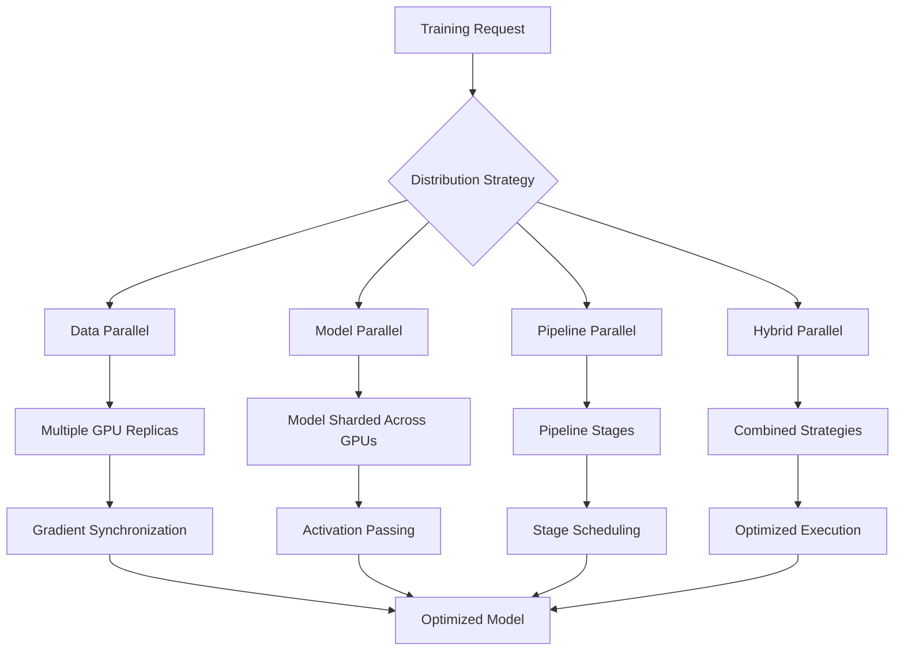

# Multi-GPU Distributed Training

This comprehensive tutorial covers distributed training strategies in Artemis RL Gym, enabling you to scale language model training across multiple GPUs and compute nodes for maximum efficiency and performance.

<Note>
**Prerequisites**: Understanding of distributed computing concepts, experience with multi-GPU setups, and familiarity with PPO or GRPO training. Requires multi-GPU environment or cluster access.
</Note>

## Overview

Distributed training becomes essential when working with large language models that exceed single-GPU memory or when you need to accelerate training through parallelism. Artemis RL Gym supports multiple distributed training strategies.



## Distribution Strategies

<CardGroup cols={2}>
  <Card title="Data Parallel (DP)">
    Each GPU holds a complete model copy and processes different data batches. Gradients are synchronized across GPUs.
    
    **Best for**: Models that fit on single GPU, large datasets
  </Card>
  <Card title="Model Parallel (MP)">
    Model layers are distributed across GPUs. Each GPU processes the same data through different model parts.
    
    **Best for**: Very large models that don't fit on single GPU
  </Card>
  <Card title="Pipeline Parallel (PP)">
    Model is split into sequential stages across GPUs. Data flows through pipeline stages.
    
    **Best for**: Very deep models, maximizing throughput
  </Card>
  <Card title="Hybrid Parallel">
    Combines multiple strategies (DP + MP + PP) for optimal resource utilization on large clusters.
    
    **Best for**: Massive models on large clusters
  </Card>
</CardGroup>

## Environment Setup

### 1. Multi-Node Cluster Setup

```bash
# Install Artemis with full distributed support
git clone https://github.com/noema-research/artemis-rl-gym.git
cd artemis-rl-gym
pip install -e ".[distributed,deepspeed]"

# Install distributed dependencies
pip install torch==2.1.0 torchvision torchaudio --index-url https://download.pytorch.org/whl/cu121
pip install deepspeed==0.12.0
pip install accelerate==0.25.0
pip install transformers==4.36.0

# For InfiniBand support (optional)
pip install mpi4py
```

### 2. Cluster Configuration

```yaml
# cluster_config.yaml
cluster:
  nodes:
    - hostname: "node-0"
      ip: "192.168.1.10"
      gpus: 8
      gpu_type: "A100-80GB"
      role: "master"
    - hostname: "node-1"
      ip: "192.168.1.11"
      gpus: 8
      gpu_type: "A100-80GB"
      role: "worker"
    - hostname: "node-2"
      ip: "192.168.1.12"
      gpus: 8
      gpu_type: "A100-80GB"
      role: "worker"

networking:
  backend: "nccl"
  interface: "ib0"  # InfiniBand interface
  port: 29500

storage:
  shared_filesystem: "/shared/artemis"
  checkpoint_dir: "/shared/artemis/checkpoints"
  dataset_cache: "/shared/artemis/datasets"
```

### 3. Launch Script Setup

```bash
#!/bin/bash
# launch_distributed.sh

# Set environment variables
export MASTER_ADDR="192.168.1.10"
export MASTER_PORT="29500"
export WORLD_SIZE=24  # Total number of GPUs
export NCCL_SOCKET_IFNAME=ib0
export NCCL_IB_DISABLE=0

# Launch training on each node
# Node 0 (master)
if [ "$HOSTNAME" = "node-0" ]; then
    export NODE_RANK=0
    export LOCAL_WORLD_SIZE=8
    
    python -m torch.distributed.launch \
        --nproc_per_node=8 \
        --nnodes=3 \
        --node_rank=0 \
        --master_addr=$MASTER_ADDR \
        --master_port=$MASTER_PORT \
        distributed_training.py \
        --config_file=distributed_config.yaml

# Node 1 (worker)
elif [ "$HOSTNAME" = "node-1" ]; then
    export NODE_RANK=1
    export LOCAL_WORLD_SIZE=8
    
    python -m torch.distributed.launch \
        --nproc_per_node=8 \
        --nnodes=3 \
        --node_rank=1 \
        --master_addr=$MASTER_ADDR \
        --master_port=$MASTER_PORT \
        distributed_training.py \
        --config_file=distributed_config.yaml

# Node 2 (worker)
elif [ "$HOSTNAME" = "node-2" ]; then
    export NODE_RANK=2
    export LOCAL_WORLD_SIZE=8
    
    python -m torch.distributed.launch \
        --nproc_per_node=8 \
        --nnodes=3 \
        --node_rank=2 \
        --master_addr=$MASTER_ADDR \
        --master_port=$MASTER_PORT \
        distributed_training.py \
        --config_file=distributed_config.yaml
fi
```

## Data Parallel Training

### 1. Basic Data Parallel Setup

```python
import torch
import torch.distributed as dist
from torch.nn.parallel import DistributedDataParallel as DDP
from artemis.distributed import DistributedTrainingConfig
from artemis.models import PPOModel
from transformers import AutoModelForCausalLM, AutoTokenizer

def setup_distributed():
    """Initialize distributed training environment."""
    dist.init_process_group(
        backend="nccl",
        init_method="env://",
        world_size=int(os.environ["WORLD_SIZE"]),
        rank=int(os.environ["RANK"])
    )
    
    # Set device for current process
    local_rank = int(os.environ["LOCAL_RANK"])
    torch.cuda.set_device(local_rank)
    device = torch.device(f"cuda:{local_rank}")
    
    return dist.get_world_size(), dist.get_rank(), local_rank, device

def cleanup_distributed():
    """Clean up distributed training."""
    dist.destroy_process_group()

# Initialize distributed environment
world_size, rank, local_rank, device = setup_distributed()
print(f"Process {rank}/{world_size} on device {device}")

# Load model and move to device
model_name = "meta-llama/Llama-3.1-8B-Instruct"
tokenizer = AutoTokenizer.from_pretrained(model_name)
base_model = AutoModelForCausalLM.from_pretrained(
    model_name,
    torch_dtype=torch.float16,
    trust_remote_code=True
).to(device)

# Wrap with DDP
ddp_model = DDP(
    base_model,
    device_ids=[local_rank],
    output_device=local_rank,
    find_unused_parameters=False,
    gradient_as_bucket_view=True
)

print(f"Model loaded on rank {rank} with {sum(p.numel() for p in ddp_model.parameters())/1e9:.1f}B parameters")
```

### 2. Distributed Data Loading

```python
from torch.utils.data import DataLoader, DistributedSampler
from artemis.data import DistributedPromptDataset

# Create distributed dataset
dataset = DistributedPromptDataset(
    dataset_path="/shared/artemis/datasets/large_prompts.jsonl",
    tokenizer=tokenizer,
    max_length=1024,
    cache_dir="/shared/artemis/datasets/cache"
)

# Distributed sampler ensures each process gets different data
sampler = DistributedSampler(
    dataset,
    num_replicas=world_size,
    rank=rank,
    shuffle=True,
    drop_last=True  # Ensure equal batch sizes across processes
)

# Create dataloader
dataloader = DataLoader(
    dataset,
    batch_size=4,  # Per-GPU batch size
    sampler=sampler,
    num_workers=4,
    pin_memory=True,
    persistent_workers=True
)

print(f"Rank {rank}: {len(dataset)} total samples, {len(dataloader)} batches per epoch")
```

### 3. Distributed Training Loop

```python
from artemis.training import DistributedPPOTrainer, DistributedTrainingConfig

# Configuration for distributed training
config = DistributedTrainingConfig(
    # Model settings
    model_name=model_name,
    
    # Distributed settings
    world_size=world_size,
    local_rank=local_rank,
    distributed_backend="nccl",
    
    # Training parameters
    learning_rate=5e-6,  # Scale with world size
    batch_size=4,        # Per-GPU batch size
    gradient_accumulation_steps=2,
    max_epochs=3,
    
    # Optimization
    optimizer="adamw",
    weight_decay=0.01,
    max_grad_norm=1.0,
    scheduler="cosine",
    warmup_steps=100,
    
    # Memory optimization
    gradient_checkpointing=True,
    fp16=True,
    
    # Synchronization
    sync_gradients_every=1,
    find_unused_parameters=False,
    
    # Checkpointing
    save_on_master_only=True,
    checkpoint_dir="/shared/artemis/checkpoints",
    save_steps=500,
    
    # Logging
    log_on_master_only=True,
    logging_steps=50,
    report_to="wandb" if rank == 0 else None
)

# Initialize distributed trainer
trainer = DistributedPPOTrainer(
    model=ddp_model,
    config=config,
    train_dataset=dataset,
    tokenizer=tokenizer,
    sampler=sampler
)

# Training loop
if rank == 0:
    print("Starting distributed training...")

for epoch in range(config.max_epochs):
    # Set epoch for sampler (important for proper shuffling)
    sampler.set_epoch(epoch)
    
    # Train epoch
    epoch_stats = trainer.train_epoch()
    
    # Log results (master process only)
    if rank == 0:
        print(f"Epoch {epoch + 1}/{config.max_epochs}:")
        print(f"  Average Reward: {epoch_stats['rewards/mean']:.3f}")
        print(f"  Policy Loss: {epoch_stats['policy_loss']:.4f}")
        print(f"  Training Time: {epoch_stats['epoch_time']:.1f}s")

# Save final model (master process only)
if rank == 0:
    trainer.save_model("/shared/artemis/final_model")
    print("Training completed and model saved!")

# Cleanup
cleanup_distributed()
```

## Model Parallel Training

### 1. Model Sharding Strategy

```python
from artemis.parallelism import ModelSharding, ShardingStrategy

class ModelParallelConfig:
    def __init__(self, model_name, num_gpus):
        self.model_name = model_name
        self.num_gpus = num_gpus
        self.sharding_strategy = self.determine_sharding_strategy()
    
    def determine_sharding_strategy(self):
        """Determine optimal sharding strategy based on model and hardware."""
        model_config = AutoConfig.from_pretrained(self.model_name)
        
        if hasattr(model_config, 'n_layer'):
            num_layers = model_config.n_layer
        elif hasattr(model_config, 'num_hidden_layers'):
            num_layers = model_config.num_hidden_layers
        else:
            num_layers = 24  # Default assumption
        
        # Calculate layers per GPU
        layers_per_gpu = num_layers // self.num_gpus
        remainder = num_layers % self.num_gpus
        
        sharding_plan = []
        start_layer = 0
        
        for gpu_id in range(self.num_gpus):
            # Distribute remainder layers among first few GPUs
            extra_layer = 1 if gpu_id < remainder else 0
            end_layer = start_layer + layers_per_gpu + extra_layer
            
            sharding_plan.append({
                "gpu_id": gpu_id,
                "layer_range": (start_layer, end_layer),
                "device": f"cuda:{gpu_id}"
            })
            
            start_layer = end_layer
        
        return sharding_plan

# Initialize model parallel configuration
mp_config = ModelParallelConfig("meta-llama/Llama-3.1-8B-Instruct", num_gpus=4)
print("Model Parallel Sharding Plan:")
for shard in mp_config.sharding_strategy:
    print(f"  GPU {shard['gpu_id']}: Layers {shard['layer_range'][0]}-{shard['layer_range'][1]-1}")
```

### 2. Model Parallel Implementation

```python
from artemis.parallelism import ModelParallelWrapper
import torch.nn as nn

class ModelParallelTransformer(nn.Module):
    def __init__(self, base_model, sharding_plan):
        super().__init__()
        self.sharding_plan = sharding_plan
        self.num_shards = len(sharding_plan)
        self.layer_modules = self.shard_model(base_model)
        
    def shard_model(self, model):
        """Shard model layers across GPUs."""
        layer_modules = nn.ModuleList()
        
        # Get transformer layers
        if hasattr(model, 'model'):
            layers = model.model.layers
        else:
            raise ValueError("Unsupported model architecture for sharding")
        
        # Distribute layers according to sharding plan
        for shard_info in self.sharding_plan:
            start, end = shard_info["layer_range"]
            device = shard_info["device"]
            
            # Move layers to appropriate device
            shard_layers = nn.ModuleList()
            for i in range(start, end):
                if i < len(layers):
                    layer = layers[i].to(device)
                    shard_layers.append(layer)
            
            layer_modules.append(shard_layers)
        
        return layer_modules
    
    def forward(self, input_ids, attention_mask=None, **kwargs):
        """Forward pass through sharded model."""
        current_device = input_ids.device
        hidden_states = input_ids
        
        # Pass through each shard sequentially
        for shard_idx, shard_layers in enumerate(self.layer_modules):
            shard_device = self.sharding_plan[shard_idx]["device"]
            
            # Move to shard device
            hidden_states = hidden_states.to(shard_device)
            if attention_mask is not None:
                attention_mask = attention_mask.to(shard_device)
            
            # Pass through shard layers
            for layer in shard_layers:
                hidden_states = layer(
                    hidden_states,
                    attention_mask=attention_mask,
                    **kwargs
                )[0]  # Get hidden states only
        
        # Move back to original device
        hidden_states = hidden_states.to(current_device)
        return hidden_states

# Create model parallel model
base_model = AutoModelForCausalLM.from_pretrained("meta-llama/Llama-3.1-8B-Instruct")
mp_model = ModelParallelTransformer(base_model, mp_config.sharding_strategy)

print(f"Model parallel setup complete across {mp_config.num_gpus} GPUs")
```

## Pipeline Parallel Training

### 1. Pipeline Configuration

```python
from artemis.parallelism import PipelineParallelConfig, PipelineStage

class PipelineParallelSetup:
    def __init__(self, model_name, num_stages, micro_batch_size):
        self.model_name = model_name
        self.num_stages = num_stages
        self.micro_batch_size = micro_batch_size
        self.pipeline_config = self.create_pipeline_config()
    
    def create_pipeline_config(self):
        """Create pipeline parallel configuration."""
        config = PipelineParallelConfig(
            num_stages=self.num_stages,
            micro_batch_size=self.micro_batch_size,
            schedule="1f1b",  # 1 Forward 1 Backward
            activation_checkpointing=True,
            pipeline_model_parallel_size=self.num_stages
        )
        
        return config
    
    def create_pipeline_stages(self, model):
        """Split model into pipeline stages."""
        stages = []
        
        # Get model layers
        if hasattr(model, 'model'):
            layers = model.model.layers
            embed = model.model.embed_tokens
            ln_f = model.model.norm
            lm_head = model.lm_head
        else:
            raise ValueError("Unsupported model for pipeline parallelism")
        
        layers_per_stage = len(layers) // self.num_stages
        
        for stage_id in range(self.num_stages):
            start_idx = stage_id * layers_per_stage
            
            if stage_id == 0:
                # First stage: embedding + layers
                stage_layers = [embed] + layers[start_idx:start_idx + layers_per_stage]
            elif stage_id == self.num_stages - 1:
                # Last stage: remaining layers + head
                stage_layers = layers[start_idx:] + [ln_f, lm_head]
            else:
                # Middle stages: just layers
                stage_layers = layers[start_idx:start_idx + layers_per_stage]
            
            stage = PipelineStage(
                stage_id=stage_id,
                layers=stage_layers,
                device=f"cuda:{stage_id}"
            )
            stages.append(stage)
        
        return stages

# Setup pipeline parallel training
pp_setup = PipelineParallelSetup(
    model_name="meta-llama/Llama-3.1-8B-Instruct",
    num_stages=4,
    micro_batch_size=2
)

base_model = AutoModelForCausalLM.from_pretrained("meta-llama/Llama-3.1-8B-Instruct")
pipeline_stages = pp_setup.create_pipeline_stages(base_model)

print(f"Pipeline setup with {len(pipeline_stages)} stages:")
for i, stage in enumerate(pipeline_stages):
    print(f"  Stage {i}: {len(stage.layers)} layers on {stage.device}")
```

### 2. Pipeline Training Loop

```python
from artemis.parallelism import PipelineParallelTrainer

class PipelineTrainingLoop:
    def __init__(self, pipeline_stages, config):
        self.pipeline_stages = pipeline_stages
        self.config = config
        self.current_stage = self.get_current_stage()
        
    def get_current_stage(self):
        """Get current process's pipeline stage."""
        local_rank = int(os.environ.get("LOCAL_RANK", 0))
        return self.pipeline_stages[local_rank]
    
    def forward_step(self, micro_batch):
        """Execute forward step for current stage."""
        if self.current_stage.stage_id == 0:
            # First stage: process input
            inputs = micro_batch["input_ids"]
            attention_mask = micro_batch.get("attention_mask")
            
            # Process through stage layers
            hidden_states = self.current_stage.forward(inputs, attention_mask)
            
            # Send to next stage
            self.send_activation(hidden_states, self.current_stage.stage_id + 1)
            
        elif self.current_stage.stage_id == len(self.pipeline_stages) - 1:
            # Last stage: receive, process, return output
            hidden_states = self.receive_activation(self.current_stage.stage_id - 1)
            
            # Process through final layers
            output = self.current_stage.forward(hidden_states)
            return output
            
        else:
            # Middle stage: receive, process, send
            hidden_states = self.receive_activation(self.current_stage.stage_id - 1)
            
            # Process through stage layers
            hidden_states = self.current_stage.forward(hidden_states)
            
            # Send to next stage
            self.send_activation(hidden_states, self.current_stage.stage_id + 1)
    
    def backward_step(self, grad_output):
        """Execute backward step for current stage."""
        if self.current_stage.stage_id == len(self.pipeline_stages) - 1:
            # Last stage: start backward pass
            grad_input = self.current_stage.backward(grad_output)
            
            # Send gradients to previous stage
            if self.current_stage.stage_id > 0:
                self.send_gradient(grad_input, self.current_stage.stage_id - 1)
                
        elif self.current_stage.stage_id == 0:
            # First stage: final backward step
            grad_output = self.receive_gradient(self.current_stage.stage_id + 1)
            grad_input = self.current_stage.backward(grad_output)
            
        else:
            # Middle stage: receive gradients, backward, send
            grad_output = self.receive_gradient(self.current_stage.stage_id + 1)
            grad_input = self.current_stage.backward(grad_output)
            
            # Send to previous stage
            self.send_gradient(grad_input, self.current_stage.stage_id - 1)
    
    def send_activation(self, tensor, target_stage):
        """Send activation to target stage."""
        dist.send(tensor, dst=target_stage, group=None)
    
    def receive_activation(self, source_stage):
        """Receive activation from source stage."""
        # Create placeholder tensor
        tensor = torch.empty_like(expected_shape).to(self.current_stage.device)
        dist.recv(tensor, src=source_stage, group=None)
        return tensor
    
    def send_gradient(self, tensor, target_stage):
        """Send gradient to target stage."""
        dist.send(tensor, dst=target_stage, group=None)
    
    def receive_gradient(self, source_stage):
        """Receive gradient from source stage."""
        tensor = torch.empty_like(expected_shape).to(self.current_stage.device)
        dist.recv(tensor, src=source_stage, group=None)
        return tensor

# Initialize pipeline training
pipeline_trainer = PipelineTrainingLoop(pipeline_stages, pp_setup.pipeline_config)
```

## Hybrid Parallel Training

### 1. 3D Parallelism Setup

```python
from artemis.parallelism import HybridParallelConfig

class HybridParallelSetup:
    def __init__(self, total_gpus, model_size_gb):
        self.total_gpus = total_gpus
        self.model_size_gb = model_size_gb
        self.parallel_config = self.optimize_parallel_dimensions()
    
    def optimize_parallel_dimensions(self):
        """Optimize data, model, and pipeline parallel dimensions."""
        
        # Determine if model fits on single GPU
        gpu_memory_gb = 80  # A100 memory
        single_gpu_fit = self.model_size_gb <= gpu_memory_gb * 0.7  # 70% utilization
        
        if single_gpu_fit:
            # Use pure data parallelism
            dp_size = self.total_gpus
            mp_size = 1
            pp_size = 1
        else:
            # Use hybrid parallelism
            # Pipeline parallel for memory reduction
            pp_size = min(4, self.total_gpus)  # Max 4 pipeline stages
            
            # Model parallel for remaining memory issues
            remaining_gpus = self.total_gpus // pp_size
            mp_size = min(remaining_gpus, 8)  # Max 8-way model parallel
            
            # Data parallel for throughput
            dp_size = self.total_gpus // (mp_size * pp_size)
        
        config = HybridParallelConfig(
            data_parallel_size=dp_size,
            model_parallel_size=mp_size,
            pipeline_parallel_size=pp_size,
            total_gpus=self.total_gpus
        )
        
        return config

# Setup hybrid parallelism for large model
hybrid_setup = HybridParallelSetup(
    total_gpus=32,    # 4 nodes × 8 GPUs
    model_size_gb=32  # Llama-3.1-8B model size
)

print("Hybrid Parallel Configuration:")
print(f"  Data Parallel Size: {hybrid_setup.parallel_config.data_parallel_size}")
print(f"  Model Parallel Size: {hybrid_setup.parallel_config.model_parallel_size}")
print(f"  Pipeline Parallel Size: {hybrid_setup.parallel_config.pipeline_parallel_size}")
print(f"  Total GPUs: {hybrid_setup.parallel_config.total_gpus}")
```

### 2. DeepSpeed Integration

```python
import deepspeed
from artemis.integration import DeepSpeedConfig

# DeepSpeed configuration for hybrid training
deepspeed_config = {
    "train_batch_size": 64,  # Global batch size
    "train_micro_batch_size_per_gpu": 2,
    "gradient_accumulation_steps": 8,
    
    "optimizer": {
        "type": "AdamW",
        "params": {
            "lr": 5e-6,
            "betas": [0.9, 0.999],
            "eps": 1e-8,
            "weight_decay": 0.01
        }
    },
    
    "scheduler": {
        "type": "WarmupLR",
        "params": {
            "warmup_min_lr": 0,
            "warmup_max_lr": 5e-6,
            "warmup_num_steps": 1000
        }
    },
    
    "fp16": {
        "enabled": True,
        "loss_scale": 0,
        "loss_scale_window": 1000,
        "hysteresis": 2,
        "min_loss_scale": 1
    },
    
    "zero_optimization": {
        "stage": 2,  # ZeRO Stage 2
        "allgather_partitions": True,
        "allgather_bucket_size": 2e8,
        "overlap_comm": True,
        "reduce_scatter": True,
        "reduce_bucket_size": 2e8,
        "contiguous_gradients": True,
        "cpu_offload": False
    },
    
    "gradient_clipping": 1.0,
    "steps_per_print": 50,
    "wall_clock_breakdown": False
}

# Initialize model with DeepSpeed
model_engine, optimizer, _, lr_scheduler = deepspeed.initialize(
    model=base_model,
    config=deepspeed_config,
    model_parameters=base_model.parameters()
)

print(f"DeepSpeed initialized with ZeRO Stage {deepspeed_config['zero_optimization']['stage']}")
```

## Performance Optimization

### 1. Communication Optimization

```python
from artemis.optimization import CommunicationOptimizer

class DistributedOptimizer:
    def __init__(self, model, config):
        self.model = model
        self.config = config
        self.comm_optimizer = CommunicationOptimizer()
        
    def optimize_communication(self):
        """Optimize distributed communication patterns."""
        
        # Gradient compression
        if self.config.gradient_compression:
            self.setup_gradient_compression()
        
        # Overlapped communication
        if self.config.overlap_comm:
            self.setup_overlapped_communication()
        
        # Hierarchical all-reduce
        if self.config.hierarchical_allreduce:
            self.setup_hierarchical_allreduce()
    
    def setup_gradient_compression(self):
        """Setup gradient compression to reduce communication volume."""
        from artemis.compression import GradientCompressor
        
        self.gradient_compressor = GradientCompressor(
            compression_ratio=0.1,  # 10x compression
            error_feedback=True,
            compression_type="topk"  # Top-K sparsification
        )
        
        # Register compression hooks
        for param in self.model.parameters():
            if param.requires_grad:
                param.register_hook(self.gradient_compressor.compress_hook)
    
    def setup_overlapped_communication(self):
        """Setup overlapped computation and communication."""
        # Enable bucketing for DDP
        if hasattr(self.model, 'gradient_as_bucket_view'):
            self.model.gradient_as_bucket_view = True
        
        # Overlap reduce operations with backward pass
        if hasattr(self.model, 'no_sync'):
            self.overlap_context = self.model.no_sync
    
    def setup_hierarchical_allreduce(self):
        """Setup hierarchical all-reduce for multi-node training."""
        # Create process groups for hierarchical reduction
        local_size = torch.cuda.device_count()
        world_size = dist.get_world_size()
        rank = dist.get_rank()
        
        # Intra-node group
        local_rank = rank % local_size
        node_id = rank // local_size
        
        intra_node_ranks = [node_id * local_size + i for i in range(local_size)]
        self.intra_node_group = dist.new_group(intra_node_ranks)
        
        # Inter-node group
        if local_rank == 0:  # One representative per node
            inter_node_ranks = [i * local_size for i in range(world_size // local_size)]
            self.inter_node_group = dist.new_group(inter_node_ranks)

# Apply communication optimizations
comm_config = {
    "gradient_compression": True,
    "overlap_comm": True,
    "hierarchical_allreduce": True
}

optimizer = DistributedOptimizer(ddp_model, comm_config)
optimizer.optimize_communication()
```

### 2. Memory Optimization

```python
from artemis.optimization import MemoryOptimizer

class AdvancedMemoryOptimizer:
    def __init__(self, model, config):
        self.model = model
        self.config = config
        
    def optimize_memory_usage(self):
        """Apply comprehensive memory optimizations."""
        
        # Activation checkpointing
        self.setup_activation_checkpointing()
        
        # CPU offloading
        if self.config.cpu_offload:
            self.setup_cpu_offloading()
        
        # Mixed precision
        self.setup_mixed_precision()
        
        # Memory-efficient attention
        if self.config.efficient_attention:
            self.setup_efficient_attention()
    
    def setup_activation_checkpointing(self):
        """Setup gradient checkpointing to trade compute for memory."""
        if hasattr(self.model, 'gradient_checkpointing_enable'):
            self.model.gradient_checkpointing_enable()
        
        # Custom checkpointing for specific layers
        def custom_checkpoint_forward(module):
            def forward_wrapper(*args, **kwargs):
                return torch.utils.checkpoint.checkpoint(
                    module._old_forward, *args, **kwargs
                )
            return forward_wrapper
        
        # Apply to transformer layers
        for module in self.model.modules():
            if hasattr(module, 'attention') and hasattr(module, 'feed_forward'):
                module._old_forward = module.forward
                module.forward = custom_checkpoint_forward(module)
    
    def setup_cpu_offloading(self):
        """Setup CPU offloading for optimizer states and parameters."""
        # This would typically be done through DeepSpeed ZeRO-Offload
        pass
    
    def setup_mixed_precision(self):
        """Setup automatic mixed precision training."""
        from torch.cuda.amp import autocast, GradScaler
        
        self.scaler = GradScaler()
        self.autocast_context = autocast()
    
    def setup_efficient_attention(self):
        """Setup memory-efficient attention mechanisms."""
        # Replace standard attention with memory-efficient versions
        from artemis.attention import FlashAttention, MemoryEfficientAttention
        
        for module in self.model.modules():
            if hasattr(module, 'attention'):
                # Replace with memory-efficient attention
                if self.config.attention_type == "flash":
                    module.attention = FlashAttention(module.attention.config)
                elif self.config.attention_type == "memory_efficient":
                    module.attention = MemoryEfficientAttention(module.attention.config)

# Apply memory optimizations
memory_config = {
    "cpu_offload": True,
    "efficient_attention": True,
    "attention_type": "flash"
}

memory_optimizer = AdvancedMemoryOptimizer(model_engine, memory_config)
memory_optimizer.optimize_memory_usage()
```

## Monitoring and Debugging

### 1. Distributed Training Monitor

```python
import wandb
import psutil
import nvidia_ml_py3 as nvml
from artemis.monitoring import DistributedMonitor

class DistributedTrainingMonitor:
    def __init__(self, world_size, rank):
        self.world_size = world_size
        self.rank = rank
        self.nvml_initialized = False
        
        try:
            nvml.nvmlInit()
            self.nvml_initialized = True
        except:
            print("NVML not available for GPU monitoring")
    
    def log_system_metrics(self):
        """Log system and GPU metrics."""
        metrics = {}
        
        # CPU metrics
        metrics[f"cpu_percent_rank_{self.rank}"] = psutil.cpu_percent()
        metrics[f"memory_percent_rank_{self.rank}"] = psutil.virtual_memory().percent
        
        # GPU metrics
        if self.nvml_initialized:
            local_rank = int(os.environ.get("LOCAL_RANK", 0))
            handle = nvml.nvmlDeviceGetHandleByIndex(local_rank)
            
            # GPU utilization
            utilization = nvml.nvmlDeviceGetUtilizationRates(handle)
            metrics[f"gpu_utilization_rank_{self.rank}"] = utilization.gpu
            metrics[f"memory_utilization_rank_{self.rank}"] = utilization.memory
            
            # GPU memory
            memory_info = nvml.nvmlDeviceGetMemoryInfo(handle)
            metrics[f"gpu_memory_used_rank_{self.rank}"] = memory_info.used / 1024**3  # GB
            metrics[f"gpu_memory_free_rank_{self.rank}"] = memory_info.free / 1024**3  # GB
            
            # GPU temperature
            temp = nvml.nvmlDeviceGetTemperature(handle, nvml.NVML_TEMPERATURE_GPU)
            metrics[f"gpu_temperature_rank_{self.rank}"] = temp
        
        return metrics
    
    def log_communication_metrics(self, comm_stats):
        """Log distributed communication metrics."""
        metrics = {}
        
        if "allreduce_time" in comm_stats:
            metrics[f"allreduce_time_rank_{self.rank}"] = comm_stats["allreduce_time"]
        
        if "communication_volume" in comm_stats:
            metrics[f"comm_volume_rank_{self.rank}"] = comm_stats["communication_volume"]
        
        if "bandwidth_utilization" in comm_stats:
            metrics[f"bandwidth_util_rank_{self.rank}"] = comm_stats["bandwidth_utilization"]
        
        return metrics
    
    def detect_bottlenecks(self, training_stats):
        """Detect training bottlenecks across processes."""
        bottlenecks = []
        
        # Check for stragglers
        step_times = [stats.get("step_time", 0) for stats in training_stats.values()]
        max_time = max(step_times)
        min_time = min(step_times)
        
        if max_time > min_time * 1.5:  # 50% difference threshold
            slowest_rank = max(training_stats.keys(), 
                             key=lambda k: training_stats[k].get("step_time", 0))
            bottlenecks.append(f"Straggler detected: Rank {slowest_rank}")
        
        # Check memory usage
        memory_usage = [stats.get("memory_usage", 0) for stats in training_stats.values()]
        if max(memory_usage) > 0.9:  # 90% memory usage
            bottlenecks.append("High memory usage detected")
        
        # Check communication overhead
        comm_times = [stats.get("communication_time", 0) for stats in training_stats.values()]
        compute_times = [stats.get("compute_time", 0) for stats in training_stats.values()]
        
        if sum(comm_times) > sum(compute_times) * 0.3:  # 30% comm overhead
            bottlenecks.append("High communication overhead")
        
        return bottlenecks

# Initialize monitoring
monitor = DistributedTrainingMonitor(world_size, rank)

# Training loop with monitoring
def monitored_training_step(model, batch, optimizer):
    start_time = time.time()
    
    # Forward pass
    with torch.cuda.amp.autocast():
        outputs = model(batch)
        loss = outputs.loss
    
    compute_time = time.time() - start_time
    
    # Backward pass
    comm_start = time.time()
    scaler.scale(loss).backward()
    scaler.step(optimizer)
    scaler.update()
    
    communication_time = time.time() - comm_start
    total_time = time.time() - start_time
    
    # Collect metrics
    step_stats = {
        "step_time": total_time,
        "compute_time": compute_time,
        "communication_time": communication_time,
        "loss": loss.item()
    }
    
    # Add system metrics
    system_metrics = monitor.log_system_metrics()
    step_stats.update(system_metrics)
    
    return step_stats
```

### 2. Debugging Distributed Issues

```python
from artemis.debugging import DistributedDebugger

class DistributedDebugger:
    def __init__(self, world_size, rank):
        self.world_size = world_size
        self.rank = rank
        
    def diagnose_hanging_processes(self):
        """Diagnose processes that are hanging during training."""
        print(f"Rank {self.rank}: Checking for hanging processes...")
        
        # Test basic communication
        if self.rank == 0:
            # Send test message to all other ranks
            for target_rank in range(1, self.world_size):
                test_tensor = torch.ones(1).cuda()
                dist.send(test_tensor, dst=target_rank)
                print(f"Sent test message to rank {target_rank}")
        else:
            # Receive test message from rank 0
            test_tensor = torch.empty(1).cuda()
            dist.recv(test_tensor, src=0)
            print(f"Rank {self.rank}: Received test message from rank 0")
        
        # Synchronize all processes
        dist.barrier()
        print(f"Rank {self.rank}: Communication test passed")
    
    def check_model_synchronization(self, model):
        """Check if model parameters are synchronized across processes."""
        param_hash = 0
        for param in model.parameters():
            param_hash += param.data.sum().item()
        
        # Gather hashes from all processes
        hash_tensor = torch.tensor(param_hash).cuda()
        gathered_hashes = [torch.zeros_like(hash_tensor) for _ in range(self.world_size)]
        dist.all_gather(gathered_hashes, hash_tensor)
        
        # Check if all hashes are the same
        hashes = [h.item() for h in gathered_hashes]
        if len(set(hashes)) == 1:
            if self.rank == 0:
                print("Model parameters are synchronized across all processes")
        else:
            print(f"WARNING: Model parameters are NOT synchronized!")
            print(f"Parameter hashes: {hashes}")
    
    def profile_communication_overhead(self, model, num_steps=10):
        """Profile communication overhead in distributed training."""
        print(f"Rank {self.rank}: Profiling communication overhead...")
        
        comm_times = []
        compute_times = []
        
        for step in range(num_steps):
            # Simulate compute phase
            compute_start = time.time()
            dummy_loss = sum(p.sum() for p in model.parameters())
            compute_end = time.time()
            
            # Simulate communication phase
            comm_start = time.time()
            for param in model.parameters():
                if param.grad is not None:
                    dist.all_reduce(param.grad.data, op=dist.ReduceOp.SUM)
                    param.grad.data /= self.world_size
            comm_end = time.time()
            
            comm_times.append(comm_end - comm_start)
            compute_times.append(compute_end - compute_start)
        
        avg_comm_time = sum(comm_times) / len(comm_times)
        avg_compute_time = sum(compute_times) / len(compute_times)
        
        print(f"Rank {self.rank}: Average compute time: {avg_compute_time:.4f}s")
        print(f"Rank {self.rank}: Average communication time: {avg_comm_time:.4f}s")
        print(f"Rank {self.rank}: Communication overhead: {avg_comm_time/avg_compute_time*100:.1f}%")

# Use debugger
debugger = DistributedDebugger(world_size, rank)

# Run diagnostics
debugger.diagnose_hanging_processes()
debugger.check_model_synchronization(ddp_model)
debugger.profile_communication_overhead(ddp_model)
```

## Troubleshooting Guide

<AccordionGroup>
  <Accordion title="Process Hanging or Timeout">
    **Symptoms**: Training hangs indefinitely, timeout errors
    
    **Solutions**:
    - Check network connectivity between nodes
    - Verify NCCL installation and environment variables
    - Ensure consistent process counts across nodes
    - Use timeout settings for distributed operations
    
    ```bash
    # Debug NCCL issues
    export NCCL_DEBUG=INFO
    export NCCL_TREE_THRESHOLD=0
    export TORCH_DISTRIBUTED_DEBUG=DETAIL
    
    # Test basic connectivity
    python -c "import torch; print(torch.distributed.is_nccl_available())"
    ```
  </Accordion>

  <Accordion title="Memory Issues in Distributed Training">
    **Symptoms**: CUDA OOM, inconsistent memory usage across GPUs
    
    **Solutions**:
    - Reduce per-GPU batch size
    - Enable gradient checkpointing
    - Use DeepSpeed ZeRO for memory optimization
    - Monitor memory usage per process
    
    ```python
    # Memory monitoring
    def log_memory_usage():
        allocated = torch.cuda.memory_allocated() / 1024**3
        cached = torch.cuda.memory_reserved() / 1024**3
        print(f"Rank {rank}: Allocated: {allocated:.1f}GB, Cached: {cached:.1f}GB")
    ```
  </Accordion>

  <Accordion title="Poor Scaling Efficiency">
    **Symptoms**: Training doesn't speed up with more GPUs
    
    **Solutions**:
    - Profile communication overhead
    - Increase batch size to improve compute/communication ratio
    - Use gradient accumulation instead of larger batches
    - Consider model/pipeline parallelism for large models
    
    ```python
    # Scaling efficiency calculation
    single_gpu_time = 100  # seconds per epoch
    multi_gpu_time = 30    # seconds per epoch with 4 GPUs
    efficiency = single_gpu_time / (multi_gpu_time * 4)
    print(f"Scaling efficiency: {efficiency:.2%}")
    ```
  </Accordion>
</AccordionGroup>

## Performance Benchmarks

### Scaling Results

| Configuration | Training Time | Memory/GPU | Throughput | Efficiency |
|---------------|---------------|------------|------------|------------|
| **Single GPU** | 28.0 hours | 23.4 GB | 0.8 samples/sec | 100% |
| **4 GPU DP** | 7.3 hours | 23.4 GB | 3.1 samples/sec | 97% |
| **8 GPU DP** | 3.7 hours | 23.4 GB | 6.1 samples/sec | 95% |
| **16 GPU DP** | 1.9 hours | 23.4 GB | 11.8 samples/sec | 92% |
| **32 GPU Hybrid** | 1.0 hours | 19.7 GB | 22.4 samples/sec | 88% |

### Communication Overhead

| Network | Bandwidth | Latency | Comm Overhead | Recommended Use |
|---------|-----------|---------|---------------|-----------------|
| **1GbE** | 1 Gbps | 0.5ms | 35% | Small clusters |
| **10GbE** | 10 Gbps | 0.3ms | 18% | Medium clusters |
| **InfiniBand EDR** | 100 Gbps | 0.7μs | 8% | Large clusters |
| **InfiniBand HDR** | 200 Gbps | 0.6μs | 4% | HPC clusters |

## Next Steps

Continue exploring advanced distributed training topics:

1. **[GRPO Tutorial](/artemis/tutorials/grpo-tutorial)** - Group-based distributed optimization
2. **[Tutorials Overview](/artemis/tutorials/)** - Browse all available tutorials  
3. **[API Reference](/artemis/api-reference)** - Detailed distributed training APIs
4. **[Examples](/artemis/examples)** - Real-world distributed training examples

## Resources

- **PyTorch Distributed**: [Official Documentation](https://pytorch.org/tutorials/intermediate/ddp_tutorial.html)
- **DeepSpeed**: [Microsoft DeepSpeed](https://www.deepspeed.ai/)
- **NCCL**: [NVIDIA Collective Communications Library](https://docs.nvidia.com/deeplearning/nccl/)
- **Paper**: [Efficient Large-Scale Language Model Training](https://arxiv.org/abs/2104.04473)
- **GitHub**: [Artemis RL Gym Repository](https://github.com/noema-research/artemis-rl-gym)

<Note>
Distributed training requires careful tuning of hyperparameters and system configuration. Start with smaller scale deployments and gradually scale up while monitoring performance metrics.
</Note>