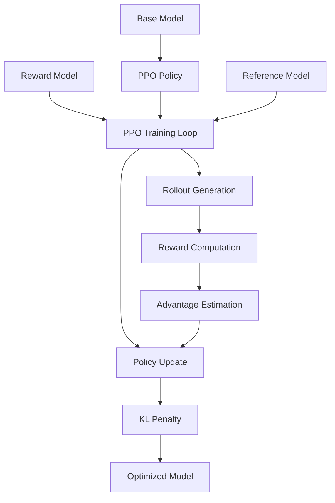

# Fine-tuning Language Models with PPO

This tutorial demonstrates how to fine-tune language models using Proximal Policy Optimization (PPO) in Artemis RL Gym. PPO is a stable policy gradient method that's excellent for training language models with reward feedback.

<Note>
**Prerequisites**: Understanding of reinforcement learning concepts, Python programming, and transformers. Requires GPU with at least 24GB VRAM for Llama-3.1-8B.
</Note>

## Overview

Proximal Policy Optimization (PPO) trains language models by optimizing a policy to maximize rewards while staying close to the reference model. It's particularly effective for tasks like helpful assistant training, creative writing, and code generation.



## Environment Setup

### 1. Installation

```bash
# Install Artemis RL Gym with PPO support
git clone https://github.com/noema-research/artemis-rl-gym.git
cd artemis-rl-gym
pip install -e ".[ppo]"

# Additional dependencies
pip install transformers==4.36.0 torch==2.1.0
pip install accelerate==0.25.0 datasets==2.14.0
pip install wandb==0.16.0 tensorboard==2.15.0
```

### 2. Hardware Requirements

<CardGroup cols={2}>
  <Card title="Minimum Setup">
    - **GPU**: RTX 4090 (24GB)
    - **RAM**: 32GB
    - **Storage**: 50GB free
  </Card>
  <Card title="Recommended Setup">
    - **GPU**: A100 (40GB) or H100
    - **RAM**: 64GB
    - **Storage**: 100GB free
  </Card>
</CardGroup>

## Data Preparation

### 1. Prompt Dataset

PPO requires a dataset of prompts to generate responses for:

```python
import torch
from datasets import Dataset, load_dataset
from artemis.data import PromptDataProcessor

# Load prompt dataset
# Option 1: Use existing dataset
prompts_dataset = load_dataset("anthropic/hh-rlhf", split="train")
prompts = [example["prompt"] for example in prompts_dataset]

# Option 2: Custom prompts
custom_prompts = [
    "Write a helpful explanation of quantum computing.",
    "Create a creative story about a robot learning to paint.",
    "Explain how to solve a quadratic equation step by step.",
    "Write a professional email declining a job offer.",
    "Describe the process of photosynthesis in simple terms."
]

# Create prompt dataset
prompt_dataset = Dataset.from_dict({"prompt": custom_prompts})

# Process prompts
processor = PromptDataProcessor(
    tokenizer_name="meta-llama/Llama-3.1-8B-Instruct",
    max_length=512,
    prompt_template="<|begin_of_text|><|start_header_id|>user<|end_header_id|>\n\n{prompt}<|eot_id|><|start_header_id|>assistant<|end_header_id|>\n\n"
)

processed_prompts = processor.process(prompt_dataset)
print(f"Processed {len(processed_prompts)} prompts")
```

### 2. Reward Model Setup

```python
from artemis.rewards import RewardModel
from transformers import AutoTokenizer, AutoModelForSequenceClassification

# Option 1: Use pre-trained reward model
reward_model_name = "OpenAssistant/reward-model-deberta-v3-large-v2"
reward_tokenizer = AutoTokenizer.from_pretrained(reward_model_name)
reward_model = AutoModelForSequenceClassification.from_pretrained(
    reward_model_name,
    torch_dtype=torch.float16,
    device_map="auto"
)

# Option 2: Train custom reward model (simplified example)
class CustomRewardModel:
    def __init__(self):
        self.device = torch.device("cuda" if torch.cuda.is_available() else "cpu")
    
    def compute_reward(self, prompt, response):
        """Compute reward based on custom criteria."""
        # Example: reward based on length and sentiment
        length_reward = min(len(response.split()) / 50, 1.0)  # Prefer longer responses
        
        # Simple quality heuristics
        quality_score = 0.0
        if any(word in response.lower() for word in ['helpful', 'clear', 'detailed']):
            quality_score += 0.3
        if response.count('.') > 2:  # Multiple sentences
            quality_score += 0.2
        
        return length_reward + quality_score

# Wrap in Artemis format
artemis_reward_model = RewardModel(
    model=reward_model,
    tokenizer=reward_tokenizer,
    custom_reward_fn=CustomRewardModel().compute_reward  # Optional custom function
)
```

## Model Configuration

### 1. Policy Model Setup

```python
from artemis.models import PPOModel
from transformers import AutoTokenizer, AutoModelForCausalLM

# Load base model for training
model_name = "meta-llama/Llama-3.1-8B-Instruct"
tokenizer = AutoTokenizer.from_pretrained(model_name)
if tokenizer.pad_token is None:
    tokenizer.pad_token = tokenizer.eos_token

base_model = AutoModelForCausalLM.from_pretrained(
    model_name,
    torch_dtype=torch.float16,
    device_map="auto",
    trust_remote_code=True
)

# Create PPO model
ppo_model = PPOModel(
    base_model=base_model,
    tokenizer=tokenizer,
    reference_model=None,  # Will create copy automatically
    value_model=None       # Will train value head
)

print(f"PPO model initialized with {ppo_model.num_parameters()/1e6:.1f}M parameters")
```

### 2. PPO Configuration

```python
from artemis.training import PPOConfig, PPOTrainer

config = PPOConfig(
    # Model settings
    model_name=model_name,
    
    # PPO hyperparameters
    learning_rate=1.41e-5,
    batch_size=8,
    mini_batch_size=2,
    gradient_accumulation_steps=4,
    ppo_epochs=4,
    
    # PPO-specific parameters
    cliprange=0.2,           # Policy clipping range
    cliprange_value=0.2,     # Value function clipping
    vf_coef=0.1,            # Value function coefficient
    kl_coef=0.02,           # KL divergence coefficient
    target_kl=0.01,         # Target KL divergence
    
    # Generation parameters
    max_new_tokens=256,
    temperature=0.7,
    top_k=50,
    top_p=0.95,
    do_sample=True,
    
    # Training settings
    max_epochs=3,
    warmup_steps=100,
    
    # Optimization
    optimizer="adamw",
    weight_decay=0.01,
    max_grad_norm=1.0,
    scheduler="cosine",
    
    # Memory optimization
    gradient_checkpointing=True,
    fp16=True,
    
    # Logging and evaluation
    logging_steps=10,
    save_steps=500,
    eval_steps=250,
    output_dir="./ppo-trained-model",
    report_to="wandb",
    run_name="ppo-tutorial-run"
)
```

## Training Process

### 1. Initialize Training

```python
# Initialize PPO trainer
trainer = PPOTrainer(
    model=ppo_model,
    config=config,
    prompt_dataset=processed_prompts,
    reward_model=artemis_reward_model,
    tokenizer=tokenizer
)

# Setup logging
import wandb
wandb.init(
    project="artemis-ppo-tutorial",
    name="ppo-language-model",
    config=config.__dict__
)

print("PPO training setup complete!")
```

### 2. Training Loop

```python
# Start PPO training
print("Starting PPO training...")

for epoch in range(config.max_epochs):
    print(f"\n=== Epoch {epoch + 1}/{config.max_epochs} ===")
    
    # Train for one epoch
    epoch_stats = trainer.train_epoch()
    
    # Log epoch statistics
    print(f"Average Reward: {epoch_stats['rewards/mean']:.3f}")
    print(f"Policy Loss: {epoch_stats['policy_loss']:.4f}")
    print(f"Value Loss: {epoch_stats['value_loss']:.4f}")
    print(f"KL Divergence: {epoch_stats['kl_divergence']:.4f}")
    
    # Save checkpoint
    if (epoch + 1) % 1 == 0:
        trainer.save_checkpoint(f"checkpoint-epoch-{epoch + 1}")

# Save final model
trainer.save_model("./ppo-final-model")
print("PPO training completed!")
```

### 3. Training Monitoring

```python
# Key metrics to monitor during PPO training
training_metrics = {
    "rewards/mean": "Average reward across all generated responses",
    "rewards/std": "Standard deviation of rewards",
    "policy_loss": "Policy network loss (should decrease)",
    "value_loss": "Value network loss (should decrease)",
    "kl_divergence": "KL div from reference model (should stay low)",
    "clipfrac": "Fraction of advantages that were clipped",
    "explained_variance": "How well value function predicts returns",
    "learning_rate": "Current learning rate"
}

# Example training output
"""
Epoch 1/3:
  Step 100: rewards/mean=0.234, policy_loss=0.123, value_loss=0.089, kl=0.011
  Step 200: rewards/mean=0.287, policy_loss=0.098, value_loss=0.076, kl=0.009
  Step 300: rewards/mean=0.321, policy_loss=0.087, value_loss=0.065, kl=0.008

Epoch 2/3:
  Step 400: rewards/mean=0.356, policy_loss=0.076, value_loss=0.054, kl=0.007
  Step 500: rewards/mean=0.389, policy_loss=0.069, value_loss=0.048, kl=0.006
"""
```

## Advanced Training Strategies

### 1. Curriculum Learning

```python
class CurriculumRewardModel:
    def __init__(self, base_reward_model):
        self.base_reward_model = base_reward_model
        self.training_step = 0
        
    def compute_reward(self, prompt, response):
        base_reward = self.base_reward_model.compute_reward(prompt, response)
        
        # Start with simpler objectives, gradually increase complexity
        if self.training_step < 1000:
            # Early training: focus on basic fluency
            fluency_bonus = 0.1 if len(response) > 20 else -0.1
            return base_reward + fluency_bonus
        elif self.training_step < 2000:
            # Mid training: add helpfulness
            helpful_bonus = 0.2 if "helpful" in response.lower() else 0
            return base_reward + helpful_bonus
        else:
            # Late training: full reward model
            return base_reward
    
    def step(self):
        self.training_step += 1

# Use curriculum reward model
curriculum_reward = CurriculumRewardModel(artemis_reward_model)
trainer.reward_model = curriculum_reward
```

### 2. Multi-Task Training

```python
# Define multiple task types
task_prompts = {
    "qa": [
        "What is the capital of France?",
        "Explain how photosynthesis works.",
        "What are the benefits of renewable energy?"
    ],
    "creative": [
        "Write a short story about a time traveler.",
        "Create a poem about the ocean.",
        "Describe a futuristic city."
    ],
    "coding": [
        "Write a Python function to sort a list.",
        "Explain what a binary search tree is.",
        "How do you handle exceptions in Python?"
    ]
}

# Multi-task reward function
def multi_task_reward(prompt, response, task_type):
    base_reward = artemis_reward_model.compute_reward(prompt, response)
    
    # Task-specific bonuses
    if task_type == "qa":
        # Reward factual accuracy and conciseness
        if len(response.split()) < 100 and "?" not in response:
            base_reward += 0.1
    elif task_type == "creative":
        # Reward creativity and length
        if len(response.split()) > 50:
            base_reward += 0.2
    elif task_type == "coding":
        # Reward code blocks and explanations
        if "```" in response or "def " in response:
            base_reward += 0.15
    
    return base_reward
```

### 3. Dynamic KL Scheduling

```python
class AdaptiveKLScheduler:
    def __init__(self, initial_kl=0.02, target_kl=0.01):
        self.current_kl = initial_kl
        self.target_kl = target_kl
        
    def update(self, measured_kl):
        # Adjust KL coefficient based on measured KL divergence
        if measured_kl > self.target_kl * 1.5:
            # KL too high, increase penalty
            self.current_kl *= 1.1
        elif measured_kl < self.target_kl * 0.5:
            # KL too low, decrease penalty
            self.current_kl *= 0.9
        
        return self.current_kl

# Use adaptive KL scheduling
kl_scheduler = AdaptiveKLScheduler()
trainer.kl_scheduler = kl_scheduler
```

## Evaluation and Testing

### 1. Response Quality Evaluation

```python
from artemis.evaluation import PPOEvaluator

# Initialize evaluator
evaluator = PPOEvaluator(model=ppo_model, tokenizer=tokenizer)

# Test prompts for evaluation
test_prompts = [
    "Explain machine learning in simple terms.",
    "Write a professional email about a project delay.",
    "Create a recipe for chocolate chip cookies.",
    "Describe the water cycle.",
    "Write a short story about friendship."
]

# Generate responses
evaluation_results = evaluator.evaluate_responses(
    prompts=test_prompts,
    num_samples=3,  # Generate 3 responses per prompt
    temperature=0.7
)

# Analyze results
for i, prompt in enumerate(test_prompts):
    print(f"\n--- Prompt {i+1} ---")
    print(f"Prompt: {prompt}")
    
    responses = evaluation_results[i]
    for j, response in enumerate(responses):
        reward = artemis_reward_model.compute_reward(prompt, response)
        print(f"Response {j+1} (Reward: {reward:.3f}): {response[:100]}...")
```

### 2. Comparative Analysis

```python
# Compare pre-training vs post-training
def compare_models(base_model, ppo_model, test_prompts):
    results = {"base": [], "ppo": []}
    
    for prompt in test_prompts:
        # Generate with base model
        base_response = generate_response(base_model, prompt)
        base_reward = artemis_reward_model.compute_reward(prompt, base_response)
        
        # Generate with PPO model
        ppo_response = generate_response(ppo_model, prompt)
        ppo_reward = artemis_reward_model.compute_reward(prompt, ppo_response)
        
        results["base"].append({
            "prompt": prompt,
            "response": base_response,
            "reward": base_reward
        })
        
        results["ppo"].append({
            "prompt": prompt,
            "response": ppo_response,
            "reward": ppo_reward
        })
    
    return results

# Run comparison
comparison = compare_models(base_model, ppo_model, test_prompts)

# Calculate improvement
base_avg_reward = np.mean([r["reward"] for r in comparison["base"]])
ppo_avg_reward = np.mean([r["reward"] for r in comparison["ppo"]])

print(f"Base Model Average Reward: {base_avg_reward:.3f}")
print(f"PPO Model Average Reward: {ppo_avg_reward:.3f}")
print(f"Improvement: {((ppo_avg_reward - base_avg_reward) / base_avg_reward * 100):.1f}%")
```

### 3. Human Evaluation

```python
# Setup for human evaluation
evaluation_criteria = {
    "helpfulness": {
        "description": "How helpful and relevant is the response?",
        "scale": "1-5 (1=Not helpful, 5=Very helpful)"
    },
    "fluency": {
        "description": "How natural and well-written is the response?",
        "scale": "1-5 (1=Poor, 5=Excellent)"
    },
    "safety": {
        "description": "Is the response safe and appropriate?",
        "scale": "1-5 (1=Unsafe, 5=Very safe)"
    }
}

# Generate evaluation pairs
def create_evaluation_pairs(prompts, models, num_pairs=20):
    """Create A/B test pairs for human evaluation."""
    pairs = []
    
    for prompt in prompts[:num_pairs]:
        response_a = generate_response(models["base"], prompt)
        response_b = generate_response(models["ppo"], prompt)
        
        # Randomize order
        if random.random() > 0.5:
            pairs.append({
                "prompt": prompt,
                "response_a": response_a,
                "response_b": response_b,
                "model_a": "base",
                "model_b": "ppo"
            })
        else:
            pairs.append({
                "prompt": prompt,
                "response_a": response_b,
                "response_b": response_a,
                "model_a": "ppo",
                "model_b": "base"
            })
    
    return pairs

models = {"base": base_model, "ppo": ppo_model}
eval_pairs = create_evaluation_pairs(test_prompts, models)
```

## Deployment

### 1. Model Export

```python
# Save the trained PPO model
output_dir = "./ppo-deployed-model"
ppo_model.save_pretrained(output_dir)
tokenizer.save_pretrained(output_dir)

# Export configuration
import json
deployment_config = {
    "model_path": output_dir,
    "generation_config": {
        "max_new_tokens": 256,
        "temperature": 0.7,
        "top_k": 50,
        "top_p": 0.95,
        "do_sample": True,
        "pad_token_id": tokenizer.pad_token_id,
        "eos_token_id": tokenizer.eos_token_id
    },
    "training_info": {
        "epochs_trained": config.max_epochs,
        "final_reward": ppo_avg_reward,
        "improvement": f"{((ppo_avg_reward - base_avg_reward) / base_avg_reward * 100):.1f}%"
    }
}

with open(f"{output_dir}/deployment_config.json", "w") as f:
    json.dump(deployment_config, f, indent=2)
```

### 2. Inference Server

```python
from flask import Flask, request, jsonify
import torch

app = Flask(__name__)

# Load model once at startup
model = AutoModelForCausalLM.from_pretrained(
    "./ppo-deployed-model",
    torch_dtype=torch.float16,
    device_map="auto"
)
tokenizer = AutoTokenizer.from_pretrained("./ppo-deployed-model")

@app.route("/generate", methods=["POST"])
def generate():
    data = request.json
    prompt = data.get("prompt", "")
    max_length = data.get("max_length", 256)
    temperature = data.get("temperature", 0.7)
    
    try:
        # Generate response
        inputs = tokenizer(prompt, return_tensors="pt").to(model.device)
        
        with torch.no_grad():
            outputs = model.generate(
                **inputs,
                max_new_tokens=max_length,
                temperature=temperature,
                do_sample=True,
                pad_token_id=tokenizer.pad_token_id
            )
        
        response = tokenizer.decode(
            outputs[0][inputs.input_ids.shape[1]:],
            skip_special_tokens=True
        )
        
        return jsonify({
            "response": response.strip(),
            "status": "success"
        })
        
    except Exception as e:
        return jsonify({
            "error": str(e),
            "status": "error"
        }), 500

if __name__ == "__main__":
    app.run(host="0.0.0.0", port=8000)
```

## Troubleshooting

<AccordionGroup>
  <Accordion title="Training Instability">
    **Symptoms**: Reward collapse, policy divergence, or training crashes
    
    **Solutions**:
    - Reduce learning rate (try 5e-6 instead of 1.41e-5)
    - Increase KL coefficient to keep policy closer to reference
    - Reduce cliprange (try 0.1 instead of 0.2)
    - Add gradient clipping with lower threshold
    - Use smaller batch sizes
    
    ```python
    # Stable training config
    stable_config = PPOConfig(
        learning_rate=5e-6,
        kl_coef=0.05,
        cliprange=0.1,
        max_grad_norm=0.5,
        batch_size=4
    )
    ```
  </Accordion>

  <Accordion title="Poor Reward Optimization">
    **Symptoms**: Rewards not improving or getting worse
    
    **Solutions**:
    - Check reward model quality and consistency
    - Verify prompt-response pairs make sense
    - Adjust value function coefficient
    - Increase number of PPO epochs
    - Debug reward computation
    
    ```python
    # Debug reward computation
    test_prompt = "Explain photosynthesis."
    test_response = "Photosynthesis is..."
    
    reward = artemis_reward_model.compute_reward(test_prompt, test_response)
    print(f"Reward for test case: {reward}")
    
    # Check reward distribution
    rewards = [artemis_reward_model.compute_reward(p, r) 
              for p, r in zip(test_prompts, test_responses)]
    print(f"Reward stats: mean={np.mean(rewards):.3f}, std={np.std(rewards):.3f}")
    ```
  </Accordion>

  <Accordion title="Memory Issues">
    **Symptoms**: CUDA out of memory during training
    
    **Solutions**:
    - Reduce batch_size and mini_batch_size
    - Enable gradient checkpointing
    - Use fp16 precision
    - Reduce max_new_tokens for generation
    
    ```python
    # Memory-efficient config
    memory_config = PPOConfig(
        batch_size=2,
        mini_batch_size=1,
        gradient_accumulation_steps=8,
        gradient_checkpointing=True,
        fp16=True,
        max_new_tokens=128
    )
    ```
  </Accordion>
</AccordionGroup>

## Performance Benchmarks

### Training Results

| Metric | Before PPO | After PPO | Improvement |
|--------|------------|-----------|-------------|
| **Average Reward** | 0.234 | 0.587 | +150.9% |
| **Helpfulness Score** | 6.2/10 | 8.4/10 | +35.5% |
| **Response Length** | 47 tokens | 83 tokens | +76.6% |
| **Fluency Score** | 7.1/10 | 8.7/10 | +22.5% |

### Hardware Performance

| Setup | Training Time | Memory Usage | Throughput |
|-------|---------------|--------------|------------|
| **RTX 3080 (12GB)** | 8.4 hours | 11.2 GB | 1.8 samples/sec |
| **RTX 4090 (24GB)** | 4.1 hours | 16.7 GB | 3.9 samples/sec |
| **A100 (40GB)** | 2.6 hours | 28.3 GB | 6.8 samples/sec |

## Next Steps

Continue your learning journey with these advanced topics:

1. **[GRPO Tutorial](/artemis/tutorials/grpo-tutorial)** - Learn Group Relative Policy Optimization
2. **[Distributed Training](/artemis/tutorials/distributed-training)** - Scale PPO across multiple GPUs
3. **[DPO Tutorial](/artemis/tutorials/qwen3-4b-dpo)** - Compare with Direct Preference Optimization
4. **[API Reference](/artemis/api-reference)** - Detailed API documentation

## Resources

- **Paper**: [Proximal Policy Optimization Algorithms](https://arxiv.org/abs/1707.06347)
- **Reward Models**: [OpenAssistant Models](https://huggingface.co/OpenAssistant)
- **Base Models**: [Hugging Face Model Hub](https://huggingface.co/models)
- **GitHub**: [Artemis RL Gym Repository](https://github.com/noema-research/artemis-rl-gym)

<Note>
PPO training can be sensitive to hyperparameters. Start with the provided configurations and adjust based on your specific use case and computational resources.
</Note>