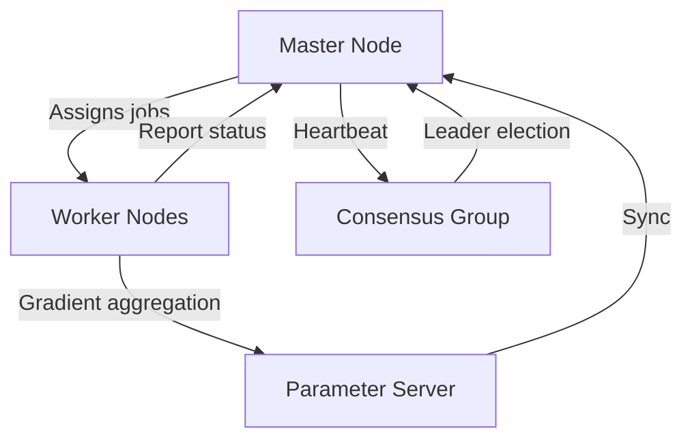

## Nexus Distributed System

The Nexus subsystem is the runtime fabric that runs on your cluster. It is responsible for node discovery, job assignment, gradient aggregation, and high-availability via leader election.

<Note>
Nexus is the backbone of distributed orchestration in LoomOS. It ensures reliable, scalable, and fault-tolerant operation of all jobs and workers in the cluster.
</Note>

### Architecture Overview



### Key Concepts
- **Master Node**: Handles cluster coordination, job scheduling, and health monitoring
- **Worker Nodes**: Execute assigned jobs, report metrics, and handle local aggregation
- **Consensus Group**: Raft-based leader election and state replication
- **Parameter Server**: Aggregates gradients and synchronizes model parameters

### Advanced Features
- Multi-master failover with Raft consensus
- Dynamic worker scaling and auto-restart
- Secure gRPC and REST APIs for management
- Real-time metrics and event streaming

### Best Practices
- Deploy at least 3 master nodes for high availability
- Tune heartbeat and election timeouts for your network
- Use secure endpoints and rotate credentials regularly
- Monitor `/metrics` and `/healthz` endpoints for cluster health

### Troubleshooting
- **Split-brain**: Ensure odd number of masters and reliable network
- **Worker flapping**: Check resource limits and node health
- **Job stuck**: Inspect master logs and job queue state
- **Slow aggregation**: Profile network and parameter server throughput

### Example: Full cluster startup
```python
from nexus.master.coordinator import MasterCoordinator, ClusterConfig
from nexus.loomnode.worker import Worker, WorkerConfig

config = ClusterConfig(cluster_name="prod_cluster", max_workers=200, enable_raft=True)
master = MasterCoordinator(config)
await master.start()

worker_cfg = WorkerConfig(worker_id="worker_01", master_endpoint="https://master:8443", gpu_count=4)
worker = Worker(worker_cfg)
await worker.start()
```

---

### Distributed Training Over the Internet (WAN)

LoomOS Nexus supports distributed training across data centers, cloud regions, and even over the public internet. This enables hybrid and multi-site clusters for large-scale, collaborative AI workloads.

#### WAN Deployment Architecture
- **Multi-region clusters**: Deploy master and worker nodes in different cloud regions or on-premises sites.
- **Global job scheduling**: Nexus can assign jobs to the nearest or most cost-effective site.
- **Cross-site parameter sync**: Parameter server and gradient aggregation support WAN-optimized protocols.

#### Security & Connectivity
- **TLS everywhere**: All traffic between masters, workers, and parameter servers is encrypted with TLS.
- **Mutual authentication**: Use client certificates or token-based auth for all nodes.
- **NAT traversal**: Workers behind NAT/firewall can connect out to public master endpoints using reverse tunnels (e.g., WireGuard, SSH tunnels, or VPN).
- **Firewall rules**: Restrict inbound ports to only those required (typically 443/8443 for HTTPS/gRPC).

#### Example: Secure WAN Worker
```python
from nexus.loomnode.worker import Worker, WorkerConfig

config = WorkerConfig(
	worker_id="wan_worker_01",
	master_endpoint="https://master.myorg.com:8443",
	gpu_count=8,
	tls_cert="/etc/loomos/certs/worker.crt",
	tls_key="/etc/loomos/certs/worker.key",
	ca_cert="/etc/loomos/certs/ca.crt",
	nat_traversal="wireguard"
)
worker = Worker(config)
await worker.start()
```

#### Best Practices for Multi-Site Clusters
- Use a global DNS or service mesh for master endpoint discovery
- Monitor WAN latency and tune heartbeat/election timeouts accordingly
- Prefer regional parameter servers for bandwidth efficiency
- Enable audit logging and anomaly detection for cross-site traffic
- Regularly rotate credentials and update firewall rules

#### Troubleshooting WAN Deployments
- **Connection drops**: Check NAT/firewall, VPN tunnels, and TLS cert validity
- **High latency**: Deploy parameter servers closer to workers, use compression
- **Split-brain**: Ensure reliable cross-site connectivity and odd number of masters

<Tip>
For production WAN deployments, always test failover and recovery across sites. Use simulated network partitions to validate consensus and job rescheduling.
</Tip>

### Master Node — responsibilities

- Worker registration and capability discovery
- Job queue management and placement decisions
- Cluster health, metrics, and scaling events

Example: starting a master coordinator (Python snippet)

```python
from nexus.master.coordinator import MasterCoordinator, ClusterConfig

config = ClusterConfig(cluster_name="training_cluster_01", max_workers=100)
master = MasterCoordinator(config)
await master.start()
```

### Worker Node — responsibilities

- Receive assigned tasks and manage execution lifecycle
- Efficient gradient compression, checkpointing, and reporting
- Local aggregation and opportunistic communication optimizations

Example: worker configuration

```python
from nexus.loomnode.worker import Worker, WorkerConfig

config = WorkerConfig(worker_id="worker_001", master_endpoint="https://master:8443", gpu_count=8)
worker = Worker(config)
await worker.start()
```

### Failover & consensus

LoomOS uses a Raft-based consensus for leader election and state replication to avoid split-brain and to allow seamless failover. Key considerations:

- Heartbeat intervals and election timeouts must be tuned for your network
- Use multiple master replicas in production for High Availability

### LoomCtl — management API

LoomCtl exposes REST endpoints for cluster and job management. Common endpoints:

```
GET /api/v1/cluster/status
POST /api/v1/jobs
GET /api/v1/jobs/{job_id}/logs
POST /api/v1/workers/{worker_id}/drain
```

#### Endpoint Discovery & Documentation

LoomCtl and the LoomOS API are self-documenting. To discover all available endpoints:

#### User-Configurable Endpoints

All LoomOS endpoints are user-configurable. You can set the API domain or endpoint URL in:
- CLI: `loomos --endpoint https://your-domain.com`
- SDK: `LoomOSClient(endpoint="https://your-domain.com", ...)`
- Environment variable: `LOOMOS_API_ENDPOINT=https://your-domain.com`

This allows you to point the CLI and SDK to any LoomOS cluster or custom domain you control.

#### Creating and Extending Endpoints

LoomOS supports custom endpoints via plugin modules. To add a new endpoint:
1. Implement a Python function and register it with the API router in your plugin.
2. Restart the master node to load the new endpoint.
3. Document the endpoint in your team’s internal docs or contribute to the main API Reference.

Example (Python, FastAPI style):
```python
from fastapi import APIRouter
router = APIRouter()

@router.post("/api/v1/custom/trigger")
async def trigger_custom_job(payload: dict):
	# Custom logic here
	return {"status": "ok"}
```

Register your router with the LoomOS master’s API on startup.

#### Enumerating Endpoints via CLI

You can list available endpoints and their usage with:
```bash
loomos api list-endpoints --endpoint https://your-cluster.loomos.com
```

Or for help on a specific command:
```bash
loomos api submit-job --help
```

Use the Python client (LoomOS SDK) for convenient programmatic access.


### LoomCtl — Cluster Management API

LoomCtl provides REST endpoints to submit jobs, check cluster status, and manage workers.

Example endpoints:

```
GET /api/v1/cluster/status
POST /api/v1/jobs
GET /api/v1/jobs/{job_id}/logs
```

See the SDK & CLI page for client examples that call LoomCtl.
